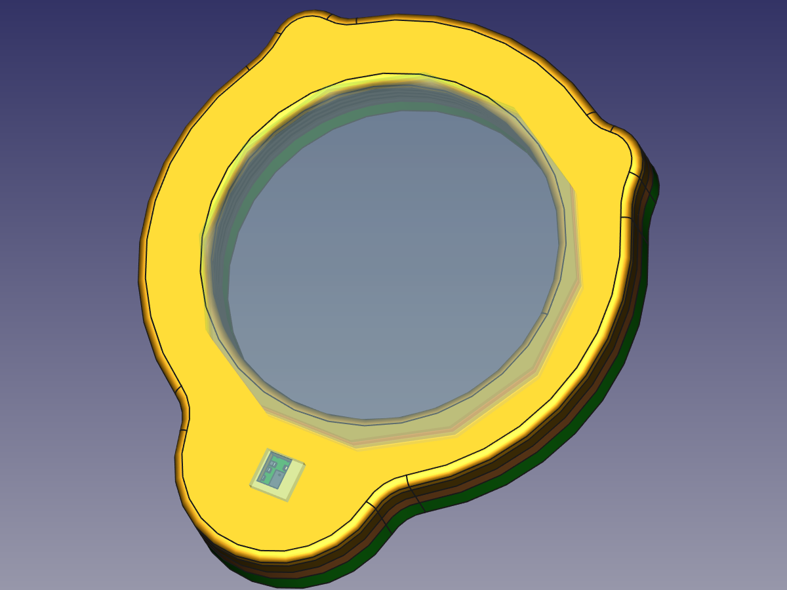
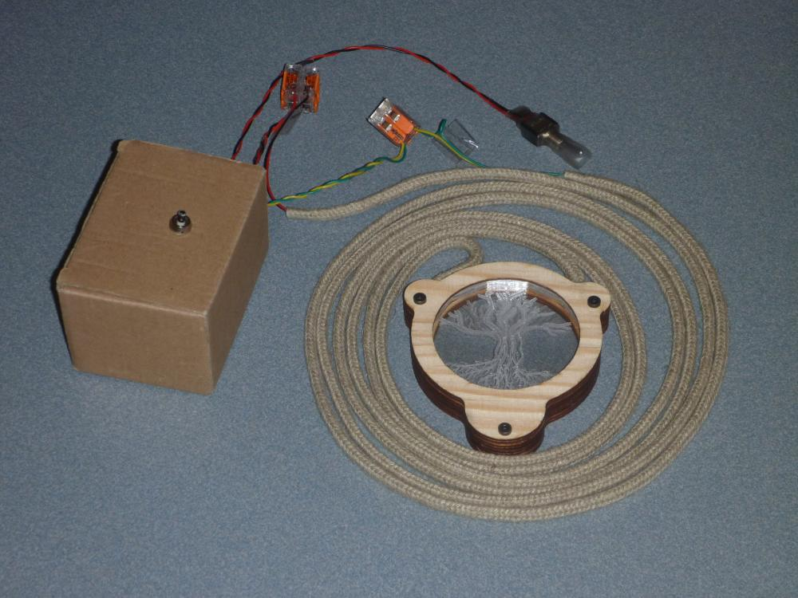

<!--lint disable list-item-indent-->
<!--lint disable list-item-bullet-indent-->
# Magic Amulet

a amulet with an power / guarding animal / creature

- it can magical glow
- useful as prop
- motive can be easily changed

## features
- material
    - wood
    - acrylic
- glowing / lighting effects
- creature / animal / symbol ideas
    - see [inspiration.md](inspiration.md)
    - saurian
    - lizard
    - owl
    - phoenix
    - dragon
    - moon
    - star
    - flower of life
    - tree of life

TODO: add art on front wood

## housing
the housing is build from 4 Layers of 4mm pine plywood parts.  
the Acrylic inlay consists of 4 2mm parts.  
the Backside is hold by 3 M3-Screws.  
for this the nuts are inserted before the first three plywood parts
(front, in_front, in_back) are glued together.

## rope
- [Hanfseil HEMPBRAID von Kanirope ø5mm Meterware (lfm) 16-fach geflochten](https://www.kanirope.de/hanfseil-hempbraid-kanirope-5mm-meterware-lfm-16-fach-geflochten)

this rope has a core that can be exchanged with cables.

## electronic

→ currently there is a APA102 60LEDs/m pixel-strip (3 segments with each 4LEDs)
fitted. (this was to get done in time :smile:)

the electronic parts are hand-soldered / assembled.
for this there is a helper that can be manufactured out of >= 1mm cardboard

→ first iteration of this did not work. holes are to big.
but i managed to create a working test:

#### Next Revision

pcb see [magic_amulet_pcbs / LEDBoard_4x4_HD](https://github.com/s-light/magic_amulet_pcbs)

and with a bunch of [sensors](sensors.md)

#### planed parts
- LEDs: Nichia 124 (switched to Rohm MSL0402RGB - they are smaller)
- driver: TLC5971 (switched to TLC5957 - just to test a new type :-) )
